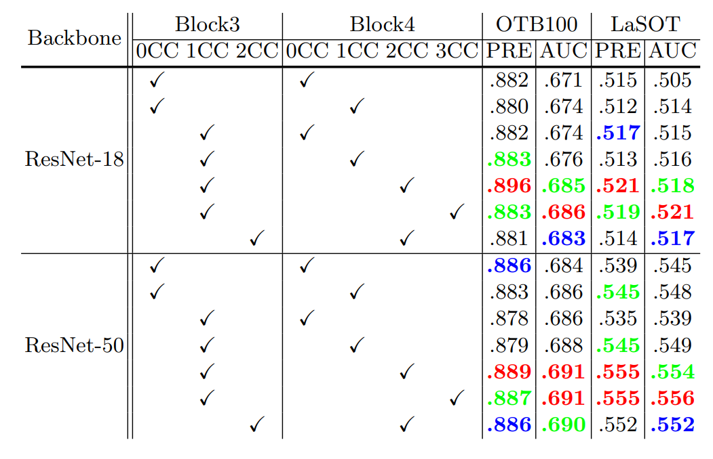

# ATCC
A general python framework for ATCC: Accurate Tracking by Criss-Cross Location Attention, based on **PyTorch**.

### The results released!
* The results of the tracker are released: [Google drive](https://drive.google.com/file/d/1_SwvTRYHHjfII_vdcs8YgbLjdHrs5ROA/view?usp=sharing)

* The results of the ablation experiments are here: [Google drive](https://drive.google.com/file/d/17cFe9q-YTsS4BUbEWNoMVnWNQxo8lkyM/view?usp=sharing)

### The code is coming soon!
For any questions, issues or recommendations, please contact Yong at Yong_Wu@shu.edu.cn or yong.wu1.shu@gmail.com
